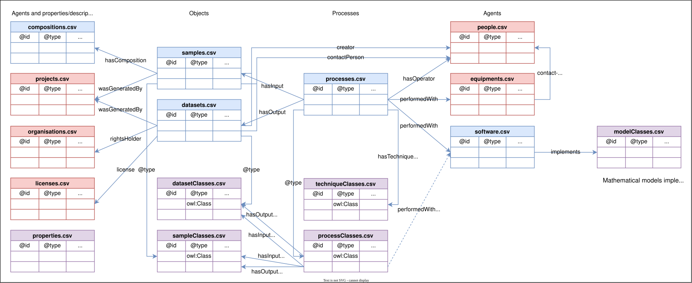
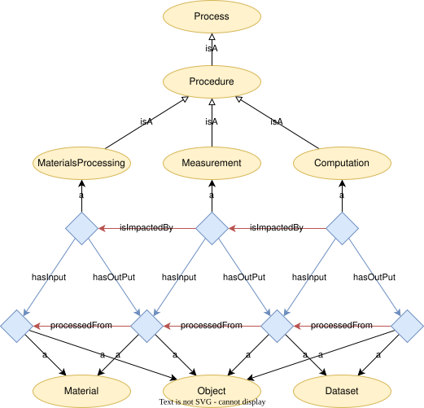

PhysMet Data Documentation Templates
====================================
The objective of this repository is to share templates and recommended
folder structures to store data in the frame of the SFI PhysMet.

Templates
---------
The [templates/](templates/) folder contain a set of CSV templates for data documentation.
Figure 1. below shows how these templates are related to each other.


> Figure 1. Overview of template tables and how they relate to each other.
>
> The colour coding is as follows; red: general tables reused between
> projects, blue: tables created by the individual data producer (not
> all tables are needed by everyone); violet: templates for new
> classes and properties.

Each row in a CSV template documents an individual, class or property that will be added to the knowledge base.
The templates can be grouped into three categories:

Individuals documented by the user:
- **[datasets.csv](templates/datasets.csv)**: Datasets. What the dataset is about, how can it be accessed and (optionally) what it contain how it is structured.
- **[samples.csv](templates/samples.csv)**: Physical samples (material objects) that are processed and characterised.
- **[processes.csv](templates/processes.csv)**: Processes and procedures. Includes materials processing, characterisation and computations. Has samples/datasets as input and output.
- **[software.csv](templates/software.csv)**: Software used for driving a process.
- **[composition.csv](templates/composition.csv)**: Chemical composition of a sample.

Class-level documentation - generalised input provided by the user:
- **[datasetClasses.csv](templates/datasetClasses.csv)**: Dataset classes, like the general concept of a TEM bright field image. An actual TEM bright field image would be an instance of this class.
- **[sampleClasses.csv](templates/sampleClasses.csv)**: Sample classes, like TEM sample. An actual TEM sample would be an instance of this class.
- **[processClasses.csv](templates/processClasses.csv)**: Process classes, like TEM bright field imaging. Has class-level samples/datasets as input and output.
- **[properties.csv](templates/properties.csv)**: For user-defined annotations, data properties or object properties.

Agents maintained at Centre-level:
- **[projects.csv](templates/projects.csv)**: Projects. May e.g. be referred to as the creator of a sample or dataset.
- **[organisations.csv](templates/organisations.csv)**: Organisations. May e.g. be referred to as the owner of a dataset.
- **[people.csv](templates/people.csv)**: People. May be a contact point for a sample, dataset or equipment or the operator of a process.
- **[equipment.csv](templates/equipment.csv)**: Equipment for materials processing, characterisation instruments, etc.


### Column headers
The default keywords that can be used in column headers are summarised in [headers.csv](headers.csv).

TODO: Describe how to extend this list.


### Prefixes
See section [identifiers](#identifiers) below for an introduction.

A list of all default prefixes can be found in [prefixes.csv](prefixes.csv).


Identifiers
-----------
Everything in the knowledge base should have a globally unique and persistent identifier.
In the context of the knowledge base we call these IDs for *International Resource Identifiers* (IRIs).

Furthermore, it is considered a [good practice](https://faircookbook.elixir-europe.org/content/recipes/findability/identifiers.html#generating-resolvable-urls) for FAIR data that IRIs are resolvable.

How SFI PhysMet address these requirements on IRIs:
- **Globally uniqueness** is ensured by the use of namespaces that we own.
- **Persistence** means that identifiers, once given, should never be changed.
- **Resolvability** this will be addressed by redirections to ensure persistence even if the documented resource is moved.

For example, a SEM dataset by Andreas Voll Bugten may be identified by the IRI
https://orcid.org/0000-0003-0311-8584/JP16/SEM/220406aa/nitride5.tif
where https://orcid.org/0000-0003-0311-8584/ is a unique prefix for all data and other resources related to Andreas.

This namespace can be abbreviated with a prefix.
Each person, project and organisation has a prefix assigned to them, which is unique within the scope of our knowledge base.

For example, we have assigned the prefix "avb" to Andreas Voll Bugten.
When documenting the above dataset, we will refer to it with the following IRI:
`abd:JP16/SEM/220406aa/nitride5.tif`.

Samples coming from Elkem, should use the Elkem prefix, and so forth.

> [!NOTE]
> An IRI written with a prefix, like `abd:JP16/SEM/220406aa/nitride5.tif`, is called a [CURIE] (compact URI).
> A CURIE differ from a [QName] in that the part following the colon may contain embedded slashes.

The prefixes are maintained in the three global tables:
- people.csv
- projects.csv
- organisations.csv


Documenting workflows
---------------------
Workflows are documented as a set of processes with objects (samples/datasets) as input or output.

Workflows can both be documented at individual-level (for provenance) or at a class-level (to describe a reusable workflow that might or might not yet have been executed).


> Figure 2. General individual-level workflow.


# treeweaver

A CLI tool to extract structured metadata from directory paths or directory
trees. Useful to go from structured projects into tables/graphs for data documentation
tools, like in PhysMet Portal (`tripper.datadoc`). `treeweaver` maps filetree
structure into fields defined by a configurable schema, e.g.:
```
user/sample/instrument/method/experiment
```

### Installation

Python 3.12 and pyyaml. Can most easily be setup with `uv`, e.g. `uv sync` in
repository directory, or add it to path with a virtual environment,
```sh
uv venv
source .venv/bin/activate
uv pip install -e .
```
Test installation with `treeweaver --help` or `treeweaver --help`.
The remaining documentation assumes `treeweaver` is available in the command line.

### Usage

Clone the repository, then go to your local (or synchronized SharePoint folder
and follow the procedure).

To use it, try this script from repo's root directory.
```bash
treeweaver tests/data --config "/sample/instrument/method/experiment"
```

For CSV output, add `--csv` and direct stdout to a file, `> out.csv`,
```bash
treeweaver tests/data --config "/sample/instrument/method/experiment" --csv > out.csv
```
with this output,
```csv
,sample,instrument,method,experiment
,JM12,SEM,EDS,220304f
,JM12,SEM,EDS,220303h
,JM12,SEM,Imaging,Areas analyzed with SIMS
...
```

#### Templating

To rewrite or derive fields, repeat `--template` with `FIELD=TEMPLATE`
entries:

```bash
treeweaver tests/data \
  --config "/processedFrom/isOutputOf/@id" \
  --template "processedFrom=physmet:sample/{processedFrom}" \
  --template "isOutputOf=physmet:instrument/{isOutputOf}" \
  --json
```

Templates can reference any extracted field by name, including `@id`. The
template target may be an existing field or a new derived field. Templates may
also be constant strings:

```bash
treeweaver tests/data \
  --config "/processedFrom/test/@id" \
  --template "newProp={processedFrom}_{@id}"
```

```bash
treeweaver tests/data \
  --config "/processedFrom/test/@id" \
  --template "kind=dataset"
```

Fields without a matching `--template` keep the existing raw behavior.

#### Ontologies

To combine with ontologies, the variables can be named from the corresponding
ontology, then later parsed with e.g. `tripper.datadoc`.
```bash
treeweaver tests/data --config "/emmo:processedFrom/emmo:isOutputOf/@type/dcterms:title"
```
has output
```
emmo:processedFrom="JM12" / emmo:isOutputOf="SEM" / @type="EDS" / dcterms:title="220304f" /
emmo:processedFrom="JM12" / emmo:isOutputOf="SEM" / @type="EDS" / dcterms:title="220303h" /
emmo:processedFrom="JM12" / emmo:isOutputOf="SEM" / @type="Imaging" / dcterms:title="Areas analyzed with SIMS" /
...
```
If combined with `tripper.datadoc`, the output should be in a `--csv` instead.

#### treeweaver.yaml
Instead of passing all of the configuration and temlates to the CLI script, you can
make a file `treeweaver.yaml` which defines all the templates. One example can be like
in the `tests/data/treeweaver.yaml`.
```yaml
# Treeweaver configuration file
root: true # Is this config file at root of filetree?
version: 1 # version
prune:     # Patterns/directories to ignore
  patterns:
    - "JO11"
intents:   # Here 3 intents are defined (run script 3 times with different outputs)
  sample:
    config: "/@id" # same as --config
    template:      # same as --template
      "@id": "physmet:sample/{@id}"
      "@type": "chameo:Sample"
  dataset:
    config: "/sampleId///@id"
    template:
      "@id": "physmet:dataset/{@id}"
      "@type": "ddoc:Dataset"
      processedFrom: "physmet:sample/{sampleId}"
      "distribution.accessUrl": "https://studntnu.sharepoint.com/:i:/r/sites/o365_SFIPhysMet/Shared%20Documents/Reseach%20Areas,%20RA%20(Open%20channel)/RA%203%20Sustainable%20and%20high-performance%20material%20development/Andreas%20Voll%20Bugten%20data/{localPath}"
  procedure:
    config: "/sampleId/instrument/label/expId"
    template:
      "@id": "physmet:procedure/{localPath}"
      "@type": "ddoc:Procedure"
      hasInput: "physmet:sample/{sampleId}"
      hasOutput: "physmet:dataset/{expId}"
```

Then, the config is automatically read and
used to write the corresponding documentation files. For instance,
```bash
treeweaver tests/data --intent "sample" --csv > output/samples.csv
treeweaver tests/data --intent "dataset" --csv > output/datasets.csv
treeweaver tests/data --intent "procedure" --csv > output/procedures.csv
```
Each intent here is created to make different type of data documentation
on the same filetree. These configuation files are recursively read,
meaning that if a `treeweaver.yaml` is found inside a folder, it will override
the configuration for that folder and all sub-folders.

If `root: False`, then the script will search parent directories until it
finds a `treeweaver.yaml` with `root: True` to find the full configuration.
See `/tests/data/JM11/SEM/Imaging/treeweaver.yaml` for an example.


[CURIE]: https://www.w3.org/2001/sw/BestPractices/HTML/2005-10-27-CURIE
[Qname]: https://en.wikipedia.org/wiki/QName
