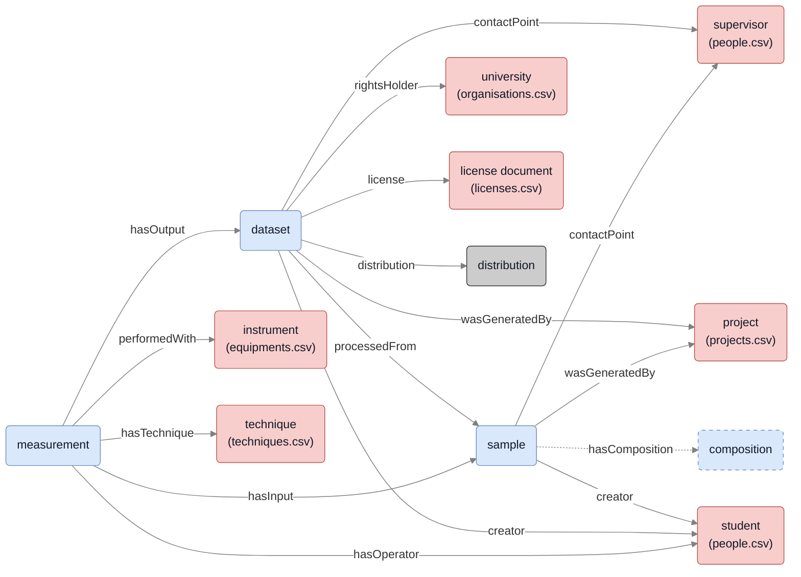

# Treeweaver2
Treeveaver2 is an updated version of the [Treeweaver] tool for producing FAIR
documentation of a directory tree with structured scientific data.
It does that by extracting metadata from pattern matching of the full path of
each file or directory.
It produces tables that can be given to [tripper.datadoc] to populate a knowledge graph.


## Installation
Requires Python 3.12 or later.
You can clone the repository and install Treeweaver2 in a virtual environment by running the following commands:

```sh
git clone https://github.com/SINTEF/physmet-data-documentation-templates.git
python -m venv .venv
source .venv/bin/activate
pip install -e .
```

Test installation with `treeweaver2 --help`.
The remaining documentation assumes `treeweaver2` is available in the command line.


## Basic usage
Create a `treeweaver2.yaml` configuration file in the of your data directory tree  (see below for details).
Then run

```
treeweaver2 <path/to/root/directory> -o datadoc.xlsx
```

to generate an .xlsx file with tables providing a (first) documentation of the directory tree.
The generated tables can be extended with new columns provided additional documentation.
When running the tool again, the tables will be updated, but the columns manually added columns will be kept.


## Configuration file (treeweaver2.yaml)
The `treeweaver2.yaml` file has 5 sections:
- [version]: Treeweaver version that this file was made for.
- [environment]: Static definition of environment variables.
- [patterns]: A list of patterns that match and assigns variables from path names.
- [exclude]: A list of glob patterns for file (or trailing directory) names to exclude.
- [templates]: Templates defining how different types of resources (e.g. dataset, measurement, sample) should be documented.

### Variable assignment
For each file or directory a new empty environment is created.
Variables are assigned to this environment at three different levels.
Later levels will overwrite assignments done in earlier levels.

1. **Computed variables** are automatically inferred from the path name and file structure.
   Treeweaver2 defines the following computed variables:
   - **rootdir**: Root directory provided at the command line.
   - **fullpath**: Full path to a file or directory to document.
   - **dirname**: The full path with the final component stripped off.
   - **filename**: The final component of the full path.
   - **escapedpath**: [%-encoded] full path (that can be used in an URL).
   - **ctime**: File or directory creation time (from the file system).
   - **mtime**: File or directory last modification time (from the file system).
   - **pattern**: The matching pattern.

2. **Static update**: After the computed variables have been assigned, they are updated from the static variable definitions in the [environment] section.

3. **Match update**: Variable assigned from pattern matching and match-specific assignments in the [pattern] section.


### Section descriptions

#### version
Treeweaver version that this file was made for.
Treeweaver2 strives maintain backward compatibility.

Example:

```yaml
version: "2.0"
```

#### templates
The templates defining how different types of resources (like samples datasets and measurements) are documented.
The example below shows templates for `sample`, `dataset` and `measurement`:

```yaml
templates:
  sample:
    "@id": "{prefix}:{sampleId}"          # Sample ID
    "@type": chameo:Sample                 # Specify that this is a sample
    wasGeneratedBy: "{project}"           # The project in which the sample was created
    contactPoint: "{contactPoint}"        # Contact person for the sample
    creator: "{creator}"                  # Who created the sample

  dataset:
    "@id": "{prefix}:{datasetId}"         # Dataset ID
    "@type": "emmo:Dataset"               # This is a dataset
    title: "{datasetId}"                  # Give the dataset a title
    description: "{description}"          # Additional description of the data
    rightsHolder: "{rightsHolder}"        # Who own's the dataset
    license: "{license}"                  # What is the license of the dataset
    wasGeneratedBy: "{project}"           # The project in which the dataset was created
    contactPoint: "{contactPoint}"        # Contact person
    creator: "{creator}"                  # Who created the dataset
    releaseDate: "{ctime}"                # When was the dataset released
    processedFrom: "{sampleId}"           # From what sample was the dataset created
    distribution.downloadURL: "{baseURL}/{escapedpath}"  # How to access the dataset

  measurement:
    "@id": "avb:{measurementId}"          # Measurement ID
    "@type": emmo:Measurement             # This is a measurement
    hasInput: "{prefix}:{sampleId}"       # Sample that was measured
    hasOutput: "{prefix}:{datasetId}"     # Dataset that was produced
    hasInterpreter: "{equipmentId}"       # Instrument used for the measurement
    hasTechnique: "{technique}"           # The technique used for the measurement
    hasOperator: "{operator}"             # Who operated the instrument
```

The documentation will be produced by substitution of variables defined in earlier sections into these templates.


#### environment
Static definition of environment variables.

Example:

```yaml
environment:
  prefix: abc                             # Prefix for datasets

  rightsHolder: "org:MyOrganisation"
  license: https://creativecommons.org/licenses/by/4.0/
  project: "proj:MyProject"               # Project that created a sample or dataset
  contactPoint: "pers:MyProjectLeader"    # Project leader or supervisor
  creator: "pers:Me"                      # Creator of sample or dataset
  operator: "pers:Me"                     # Operator of an instrument

  # URL to the root folder of your data
  baseURL: "https://studntnu.sharepoint.com/:i:/r/sites/o365_SFIPhysMet/..."
```


#### patterns
A list of patterns that match and assigns variables from path names.

Lets assume that you have a file structure that looks as follows

```
Data
├── README.txt
└── SEM_Hitachi
    ├── EBSD
    │   └── sample1
    │   │   └── 250303
    │   │       └── scan001.ang
    │   └── sample2
    │       └── 250304
    │           └── scan001.ang
    └── BSE
        └── sample1
        │   └── 250301
        │       ├── img1.tif
        │       ├── img2.tif
        │       └── img3.tif
        └── sample2
            └── 250302
                ├── img1.tif
                └── img2.tif
```

This is a nice well-defined file structure that can be matched with the following pattern:

```yaml
patterns:
- "Data/{instrument}/{technique}/{sample}/{session}/{datafile}":
    vardefs:
      sampleId: "{sample}"
      datasetId: "data-{sample}-{technique}-{experiment}"
      measurementId: "{sample}-{technique}-{experiment}"
      equipmentId: "equip:{instrument}"
      processedFrom: "{prefix}:{sample}"
```

Here one pattern is defined, that will match the leaf files, assigning the variables `instrument`, `technique`, `sample`, `session` and `datafile` based on the matching parts of the full path of each file.
The `vardefs` field will define additional variables based on the new environment.

Currently patterns supports the following fields:
- **vardefs**: Variable definitions based on the new environment.
- **appliesTo**: List of template names that the pattern applies to.
  The default is to apply it to all patterns.


#### exclude
A list of glob patterns for file (or trailing directory) names to exclude in the pattern matching.


## Generated output
The `treeweaver2` tool generates a table for each template defined in the configurations.

The [datadoc] sub-package of [tripper] can be used to store the generated documentation in a knowledge graph.
Each matching path will create the small (section of) a knowledge graph, as illustrated in Figure 1.


**Figure 1**. Generated section of a knowledge graph showing interrelations between the generated `sample`, `dataset` and `measurement` (blue boxes) and their relation to shared resources (red boxes). The dataset `distribution` (gray box) is also generated, while the relations to the `composition` must be entered by hand (see below). Colour codes are the same as in the [templates figure] in the [README] file.


[treeweaver1]: treeweaver.md
[%-encoded]: https://en.wikipedia.org/wiki/Percent-encoding
[version]: #version
[environment]: #environment
[patterns]: #patterns
[exclude]: #exclude
[templates]: #templates
[tripper]: https://github.com/EMMC-ASBL/tripper
[datadoc]: https://emmc-asbl.github.io/tripper/latest/datadoc/introduction/
[templates figure]: https://github.com/SINTEF/physmet-data-documentation-templates/raw/main/figs/tables.svg
[README]: https://github.com/SINTEF/physmet-data-documentation-templates/blob/main/README.md
