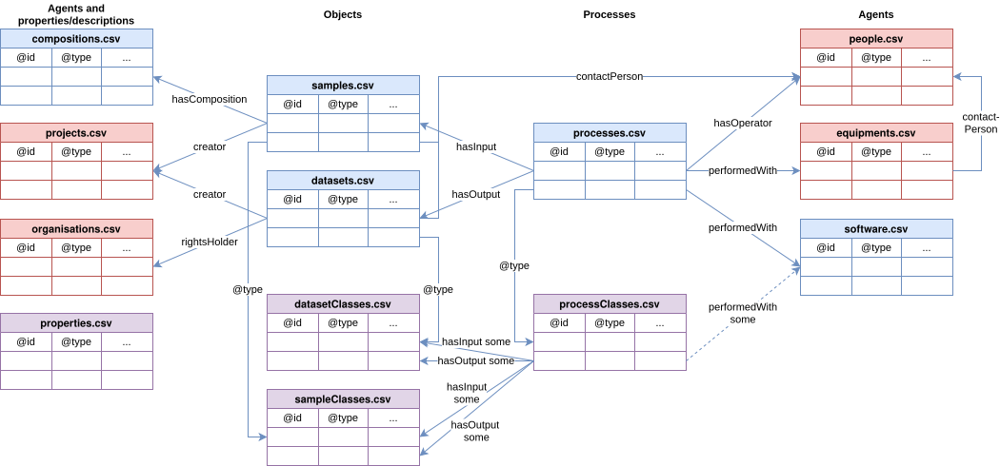

Templates
=========
This folder contain a set of templates for data documentation.
The figure below shows an overview of the templates and how they relate to each other.

> Figure 1. Overview of template tables and how they relate to each other.
>
> The colour coding is as follows; red: general tables reused between
> projects, blue: tables created by the individual data producer (not
> all tables are needed by everyone); violet: templates for new
> classes and properties.

Documenting workflows
---------------------

> Figure 2. General workflow.
